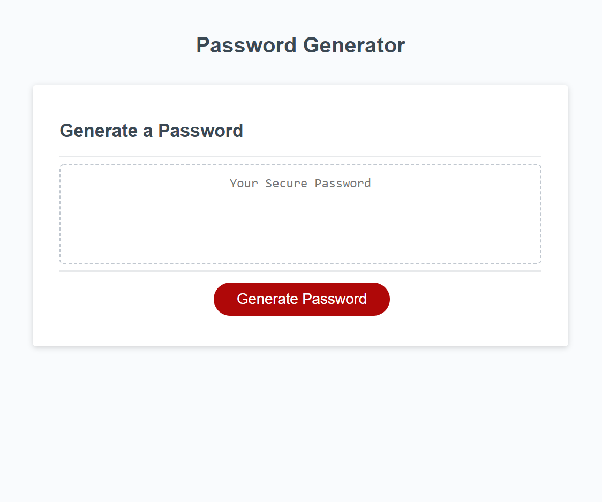
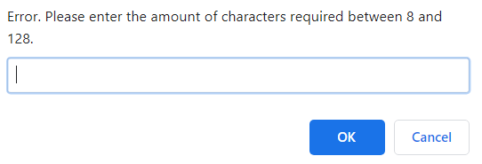

# Password Generator

# Usage

This homework was desigend to be used a Password Generator. The user can input their character requirements and the generator will output a random set of characters. This capability will be showcased once the button "Generate Password" is clicked. 




## Working website URL:

https://jdroyko.github.io/passwordGen/

### Provided Requirements

The sections 'User Story' and 'Acceptance Criteria' are derived from the README.md presented on the homework. 

#### User Story

```
AS AN employee with access to sensitive data
I WANT to randomly generate a password that meets certain criteria
SO THAT I can create a strong password that provides greater security
```

#### Acceptance Criteria

```
GIVEN I need a new, secure password
WHEN I click the button to generate a password
THEN I am presented with a series of prompts for password criteria
WHEN prompted for password criteria
THEN I select which criteria to include in the password
WHEN prompted for the length of the password
THEN I choose a length of at least 8 characters and no more than 128 characters
WHEN prompted for character types to include in the password
THEN I choose lowercase, uppercase, numeric, and/or special characters
WHEN I answer each prompt
THEN my input should be validated and at least one character type should be selected
WHEN all prompts are answered
THEN a password is generated that matches the selected criteria
WHEN the password is generated
THEN the password is either displayed in an alert or written to the page
```

# Process

Utilized parseInt to get the integer not the string from the Prompt
```
  var setLength = parseInt(prompt("Please enter the amount of characters required between 8 and 128. "));
  if (setLength < 8 || setLength > 128) {
    alert("Error. Please enter the amount of characters required between 8 and 128. ");
    return
  }
```

Utilized a lot of the push function into the arrays to get the result
```
  if (options.lower) {
    possChars = possChars.concat(lowerChars);
    guarChars.push(randomEl(lowerChars));
  }
```


## Using Character Set
The symbols function does not use this because the character range in the Character Set is not consistent, and a cleaner code could be derived from listing the symbols as an array.

## Error feature

Should the user not enter a valid number to set the character set, an error will prompt them to re-enter another number within the acceptable paramenters. 




# Utilized Sources:

*JavaScript Password Generator* - https://www.youtube.com/watch?v=duNmhKgtcsI

*Build A Password Generator With JavaScript -Tutorial* - https://www.youtube.com/watch?v=iKo9pDKKHnc

*Password Generator with Javascript* - https://dev.to/olawanle_joel/password-generator-with-javascript-57c

*Random Password Generator Tutorial* - https://www.youtube.com/watch?v=9sT03jEwcaw

*Create A Password Generator With JavaScript* - https://www.youtube.com/watch?v=MW1wz-PAOaE

*Study GroupMembers:* Joey Kouneski, Eric Cole, Ryan Scherr, Reginald Mace, Caitlin Bopp, Jashawn Stewart

*Tutor*: Kris Renaldi
